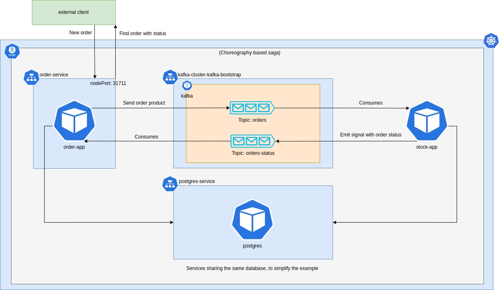

# Start environment

    minikube start --memory 4248 --static-ip 192.168.85.2

# Create database

    kubectl apply -f k8s/db-secret.yaml

    kubectl apply -f k8s/db.yaml

    Get psql pod name (kubetcl get pods) and run: kubectl exec -it postgres-... -- bash

    psql -h localhost -U postgres -d postgres

    create table order_product (id bigserial primary key, product_id bigint not null, status text not null);
    create table stock (id bigserial primary key, amount bigint not null, product_id bigint not null, unique (product_id));
    create index stock_product_id on stock (product_id);

    insert into stock values (1, 10, 100), (2, 75, 200), (3, 100, 300);

# Create Kafka broker

    kubectl create namespace kafka

    kubectl create -f 'https://strimzi.io/install/latest?namespace=kafka' -n kafka

    kubectl apply -f k8s/kafka.yaml -n kafka

# Create services

    eval $(minikube docker-env)

    In services/order-service run: ./gradlew build && docker build -t my-store/order-service .

    In services/stock-service run: ./gradlew build && docker build -t my-store/stock-service .

    kubectl apply -f k8s/services.yaml

# Test

    curl -d '{"productId":100}' -H "Content-Type: application/json" -X POST http://192.168.85.2:31711/orders

    You can see the result using:
        1 - Accessing the database
        2 - Pod logs (kubectl logs order-app-... -f)
        3 - curl http://192.168.85.2:31711/orders/ + ID returned in POST method

# Remove cluster / minikube

    minikube delete
